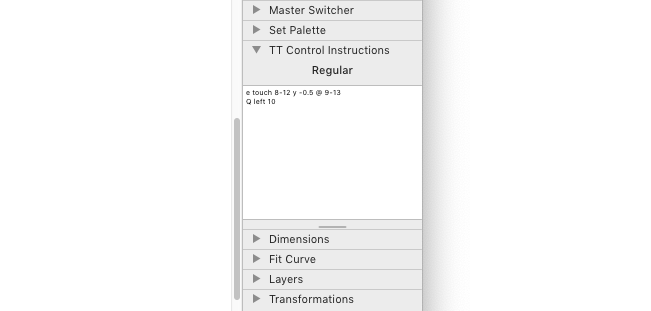

# TT Control Instructions Palette

This is a plugin for the [Glyphs font editor](http://glyphsapp.com/). It adds a palette to the sidebar for writing [ttfAutohint control instructions](https://www.freetype.org/ttfautohint/doc/ttfautohint.html#control-instructions).

### Installation

1. Open *Window > Plugin Manager.*
2. Click the Install button next to the *TT Control Instructions Palette* entry.
3. Restart Glyphs.

### Usage Instructions

0. Open the *TT Control Instructions* palette in the Palette sidebar (Cmd-Opt-P).
1. Open a glyph for editing.
2. Open the Preview area by clicking on the eye symbol in the bottom left of the window.
3. Pick an instance in the Preview menu in the bottom left of the window.
4. **Important:** click with the mouse somewhere in Edit view and, before you proceed, *make sure the instance name displayed in the palette matches the chosen instance.* If you forget this, you run the risk of the palette overwriting existing instructions in the wrong instance.
5. Type your [ttfAutohint control instructions](https://www.freetype.org/ttfautohint/doc/ttfautohint.html#control-instructions) in the panel. To insert a newline, you need to paste it. By default, the palette should add an empty line at the end, you can copy it from there.
6. Press Return to confirm your entry.

#### Tips for working efficiently:

* For a quick reminder of the control instruction syntax, hold your mouse pointer for a second over the palette, and you will see a tooltip showing two examples. Alternatively switch to display no instance or *Show All Instances* in the Preview area, and click once in the canvas. The palette will show a placeholder text showing instruction code samples.
* Run Windows in a virtualisation app like VMware Fusion, Parallels, or the like.
* For testing, keep a waterfall open in Windows. To do so, you can e.g. point a web browser to the built-in preview server: In the TT Instructor, right-click and choose *Show Preview Address…* from the context menu. Paste the address into your Windows browser of choice.
* Switch to the TT Instructor tool (shortcut I) to see TT point index numbers.
* To see index numbers for all TT points, including off-curves, run this Python command in *Window > Macro Panel:*
  `Glyphs.defaults["TTPreviewAlsoShowOffCurveIndexes"] = True`
* The font size in the palette is kept small intentionally because it assumes that you are zoomed in with the macOS screen zoom in order to inspect the pixel images in small sizes. To activate the screen zoom, go to *System Preferences > Accessibility > Zoom.* There, turn on the *Scroll gesture with modifier keys,* and turn off *Smooth images.* Zoom in by holding down the modifier key(s) specified and simultaneously rolling the scroll wheel of your mouse or sliding two fingers forward and backward on the trackpad.
* Install the [mekkablue scripts](http://github.com/mekkablue/Glyphs-Scripts), and in *System Preferences > Keyboard > Shortcuts > App Shortcuts > Glyphs,* set keyboard shortcuts for *Masters > Show next instance* and *Show previous instance.* This way you can quickly switch between instances.
  
### Known Issues

After you changed the current instance, you need to click once in the canvas to update the instance the palette will edit.

### Requirements

The plugin needs Glyphs 2.5 or higher. I assume it will not work in earlier versions.

### License

Copyright 2018 Rainer Erich Scheichelbauer (@mekkablue).
Based on sample code by Georg Seifert (@schriftgestalt) and Jan Gerner (@yanone).

Licensed under the Apache License, Version 2.0 (the "License");
you may not use this file except in compliance with the License.
You may obtain a copy of the License at

http://www.apache.org/licenses/LICENSE-2.0

See the License file included in this repository for further details.
